# INT3120 20

# Tuần 1:

- Bài 1: Giới thiệu Flutter
- Bài 2: Cài đặt Flutter
- Bài 3: Tạo ứng dụng Flutter đầu tiên  
  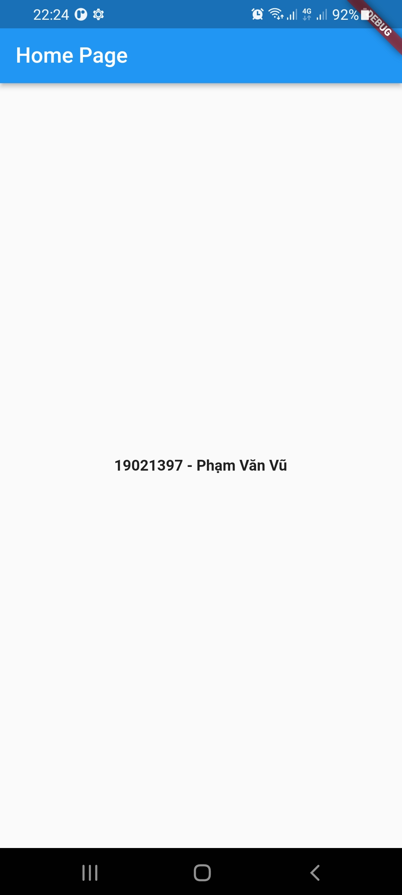  
- Bài 4: Kiến trúc ứng dụng Flutter
- Bài 5: Giới thiệu ngôn ngữ Dart
- Bài 6: Widget trong Flutter  
   
- Bài 7: Layout trong Flutter 
   

# Tuần 2:

- Bài 8: Gesture trong Flutter 
  
  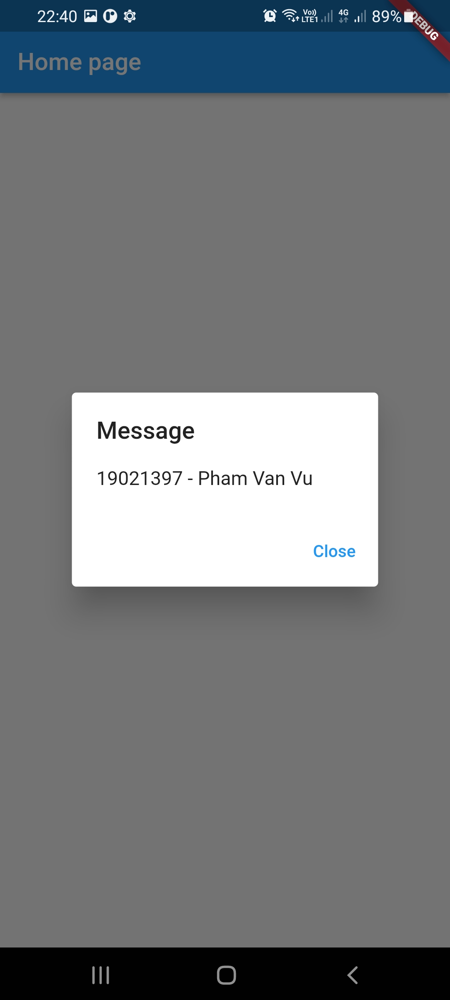 
- Bài 9: Quản lý trạng thái trong Flutter  
- Bài 10: Statefulwidget trong Flutter 
   
- Bài 11: ScopedModel trong Flutter 
   
- Bài 12: Navigator và Routing 
  
  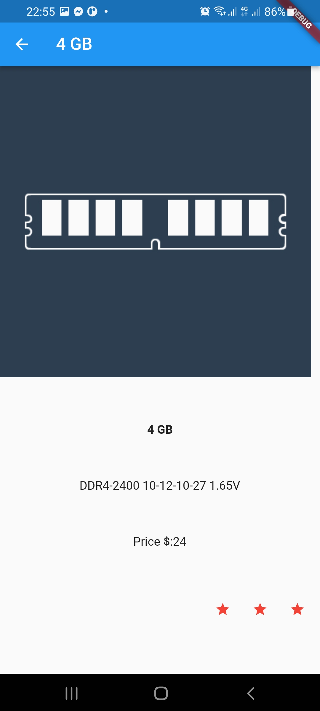 
- Bài 13: Animation 
   
- Bài 16: Giới thiệu về package 
  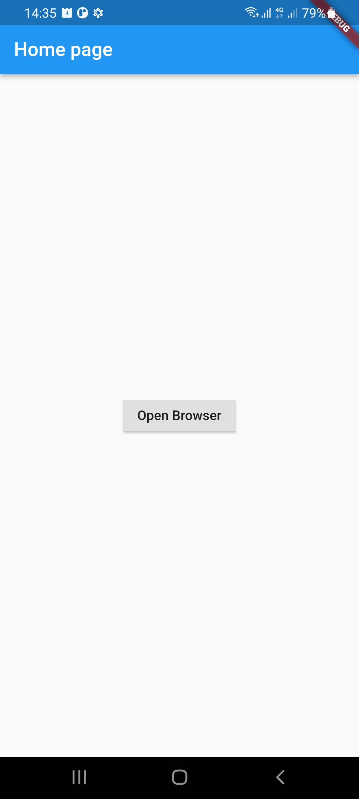
  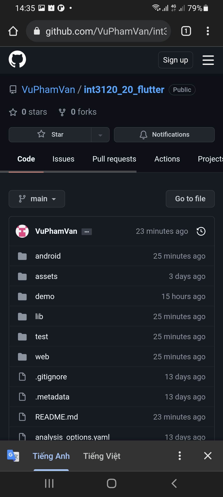 
- Bài 17: REST API 

- Bài 18: Khái niệm về Database 
  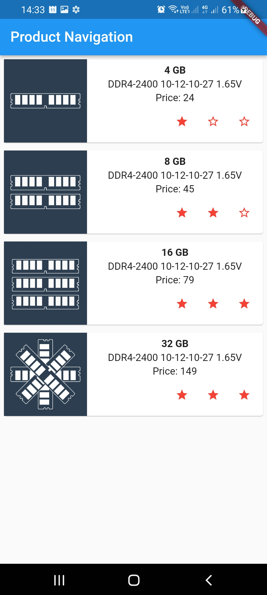
  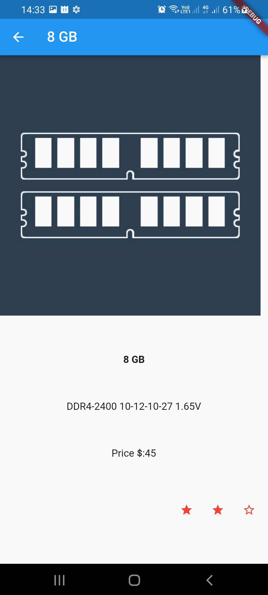 
- Bài 19: Chuyển đổi ngôn ngữ 
  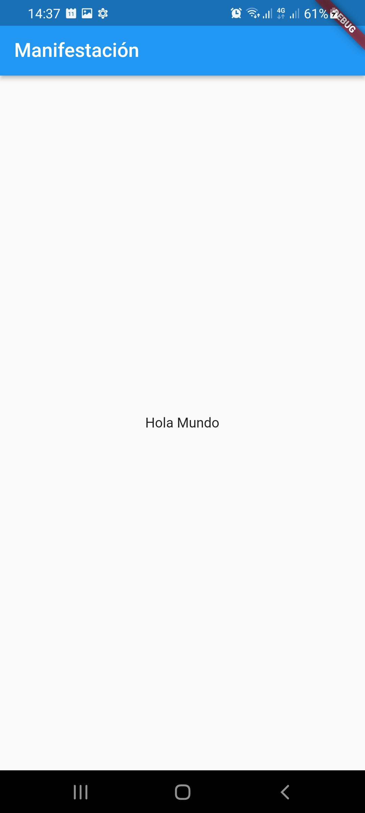
  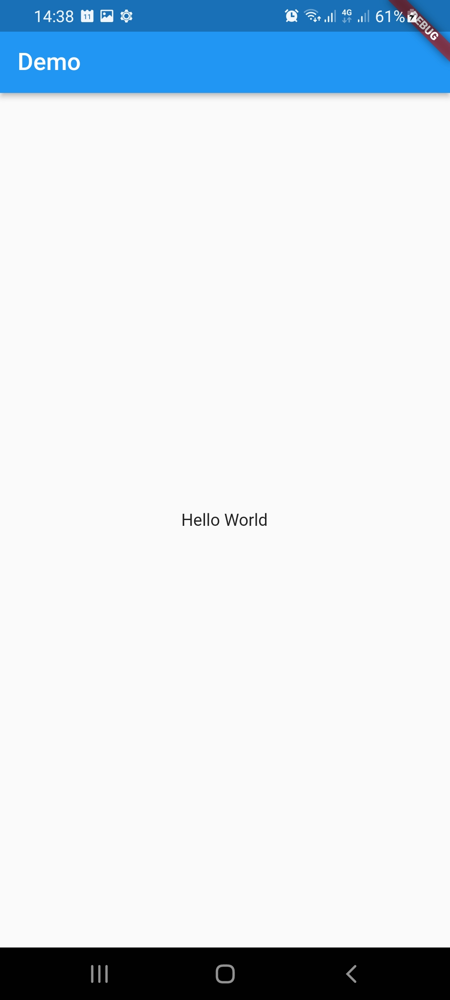 
- Bài 20: Testing 
  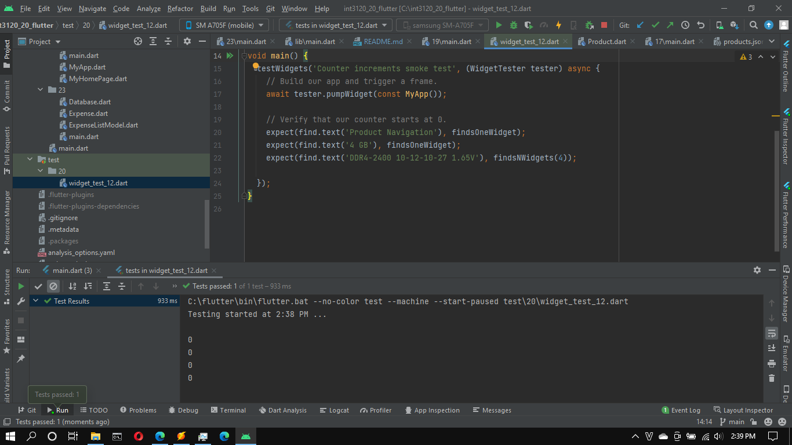 
- Bài 21: Xuất ứng dụng trong Flutter 
  
   
- Bài 22: Công cụ phát triển 
  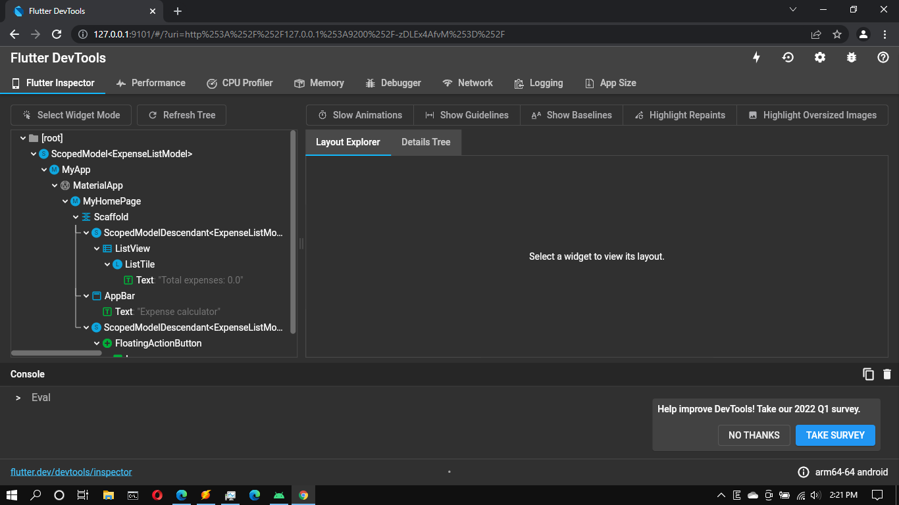
  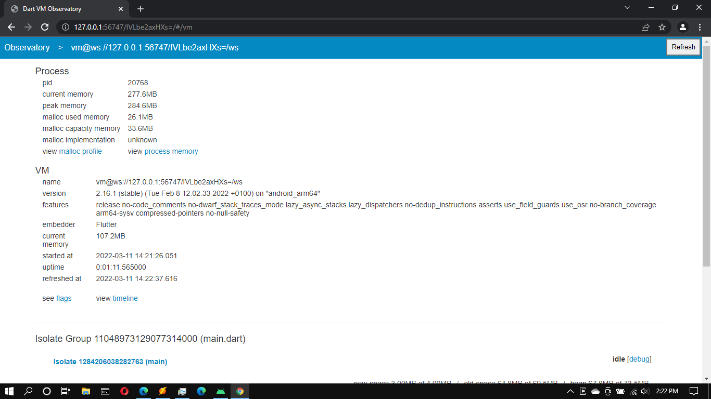 
- Bài 23: Viết ứng dụng hoàn chỉnh 
  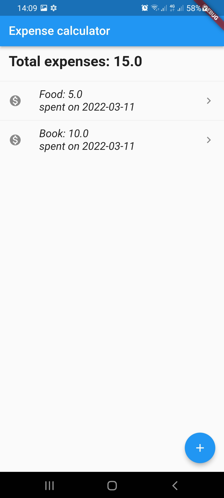
   
