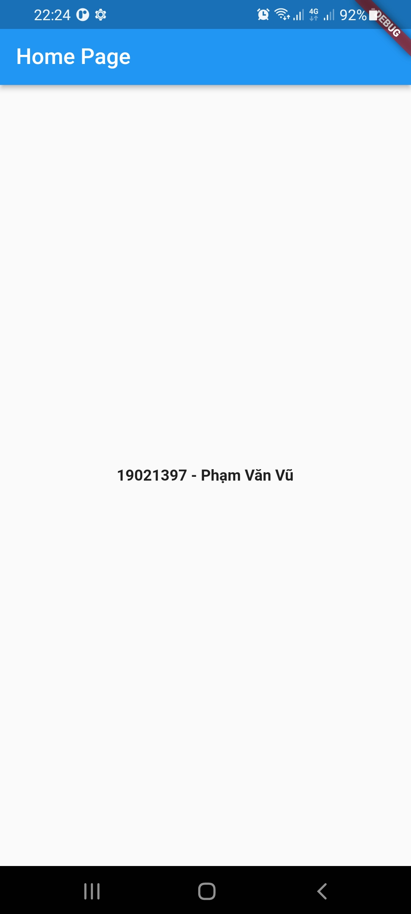
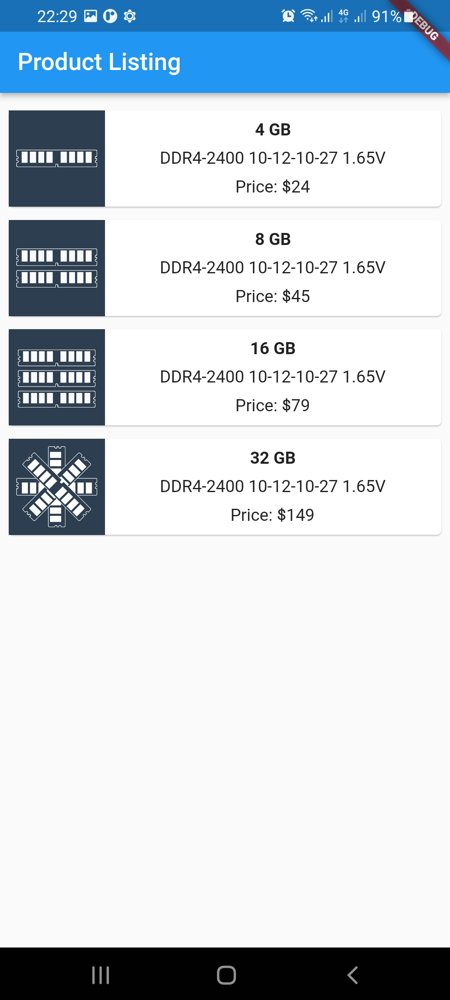
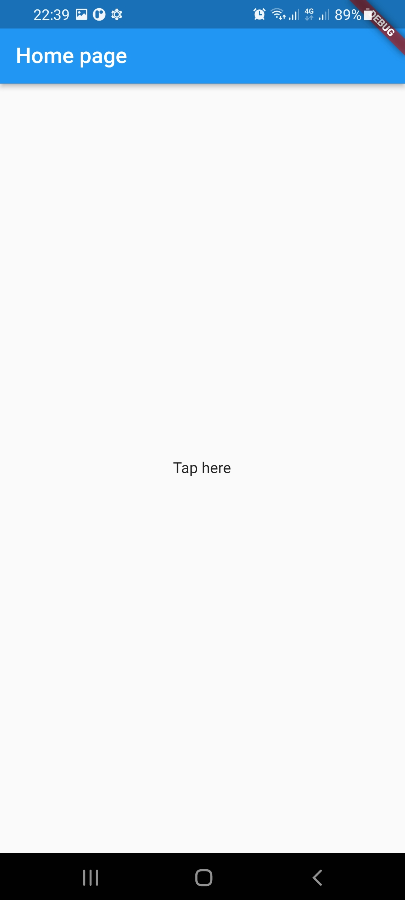
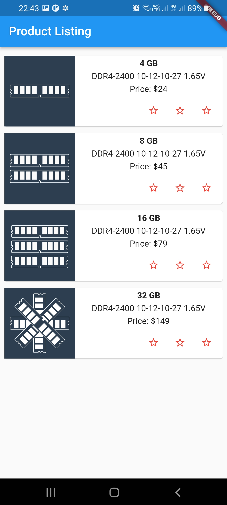
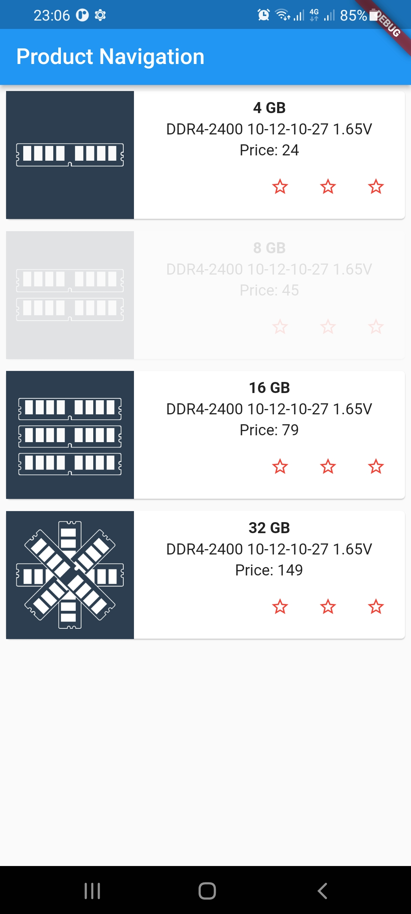

# INT3120 20

# Tuần 1:

- Bài 1: Giới thiệu Flutter
- Bài 2: Cài đặt Flutter
- Bài 3: Tạo ứng dụng Flutter đầu tiên
  
- Bài 4: Kiến trúc ứng dụng Flutter
- Bài 5: Giới thiệu ngôn ngữ Dart
- Bài 6: Widget trong Flutter
  
- Bài 7: Layout trong Flutter
  

# Tuần 2:

- Bài 8: Gesture trong Flutter
  
- Bài 10: Quản lý trạng thái Sate trong Flutter
  
- Bài 11: ScopedModel trong Flutter
  
- Bài 12: Navigator và Routing
  
- Bài 13: Animation
  